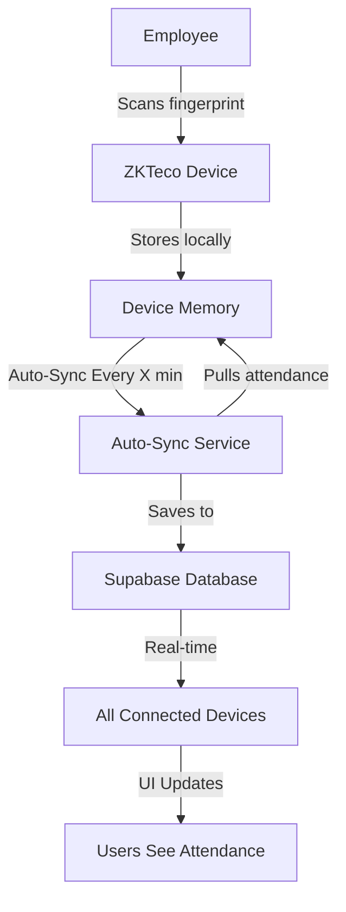

# ZKTeco Auto-Sync Implementation

## Overview
Automatic attendance synchronization has been implemented to automatically pull attendance logs from the ZKTeco device at regular intervals without manual intervention.

## Features

### ✅ Automatic Polling
- **Automatic sync** runs in the background while the app is open
- **Configurable intervals**: 1, 5, 10, 15, or 30 minutes
- **Real-time updates**: New attendance automatically appears in the app
- **Silent operation**: Only shows notifications when new records are found
- **Smart syncing**: Checks last 7 days to catch any missed records

### ✅ User Controls
- **Toggle switch**: Enable/disable auto-sync with one click
- **Interval selector**: Choose how often to check the device
- **Last sync time**: See when the last sync occurred
- **Manual override**: Still allows manual sync anytime

## How It Works



## Usage

### 1. Enable Auto-Sync

1. Open the **Attendance** page
2. Click **"Device Sync"** button
3. Toggle **"Automatic Sync"** switch to ON
4. Select sync interval (default: 5 minutes)

### 2. Monitor Sync Status

- **Green indicator**: Auto-sync is active
- **Last synced time**: Shows when last sync occurred
- **Notifications**: Appear when new attendance is synced

### 3. Manual Sync (Optional)

Even with auto-sync enabled, you can still manually sync:
- Click **"Sync Attendance from Device"** button
- Forces immediate sync outside the schedule

## Architecture

### Files Created

#### 1. **`src/services/zktecoAutoSyncService.ts`**
Core auto-sync service that manages polling and synchronization.

**Key Methods:**
```typescript
ZKTecoAutoSyncService.start(intervalMinutes, onSyncCallback)
ZKTecoAutoSyncService.stop()
ZKTecoAutoSyncService.setInterval(intervalMinutes)
ZKTecoAutoSyncService.manualSync()
ZKTecoAutoSyncService.isActive()
ZKTecoAutoSyncService.getLastSyncTime()
```

**How It Works:**
- Uses `setInterval()` to poll device at configured frequency
- Syncs last 7 days of attendance to catch missed records
- Silently handles errors to avoid annoying users
- Calls callback function on successful sync for UI updates

#### 2. **`src/hooks/useZKTeco.ts`** (Updated)
Added `useAutoSync()` hook for React component integration.

**Hook API:**
```typescript
const autoSync = useAutoSync();

// Properties
autoSync.isActive        // boolean: Is auto-sync running?
autoSync.interval        // number: Current interval in minutes
autoSync.lastSyncTime    // Date | null: Last sync timestamp

// Methods
autoSync.start(minutes)  // Start auto-sync
autoSync.stop()          // Stop auto-sync
autoSync.setInterval(minutes)  // Change interval
autoSync.manualSync()    // Force immediate sync
```

**Features:**
- Manages auto-sync state
- Invalidates React Query cache on sync
- Provides real-time status updates

#### 3. **`src/components/ZKTecoSyncDialog.tsx`** (Updated)
Enhanced UI with auto-sync controls.

**New Components:**
- Toggle switch for enabling/disabling
- Interval dropdown selector
- Last sync time display
- Status indicator
- Help text explaining behavior

## Configuration

### Sync Intervals
- **1 minute**: Very frequent (for testing)
- **5 minutes**: Default, good balance ⭐
- **10 minutes**: Less frequent
- **15 minutes**: Moderate frequency
- **30 minutes**: Battery-friendly

### Date Range
Auto-sync pulls attendance from **last 7 days** to ensure no records are missed.

## Behavior

### When Auto-Sync is Active:
✅ Runs in background while app is open  
✅ Shows toast notification when new attendance found  
✅ Updates UI automatically via real-time subscriptions  
✅ Silently retries if device temporarily unavailable  
✅ Stops when dialog is closed or page is navigated away  

### When Auto-Sync is Inactive:
❌ No automatic polling  
❌ Must use manual "Sync Attendance" button  
✅ Still shows real-time updates from other users' syncs  

## Network Requirements

### LAN Connection Required
- App must be on same network as device (192.168.1.x)
- Auto-sync stops working if device becomes unreachable
- No error spam if device goes offline (silent retry)

### Cloud Viewing
- Once synced to Supabase, attendance visible from anywhere
- Real-time updates work globally via Supabase Realtime

## Performance

### Battery & Resources
- **Minimal impact**: Only makes HTTP request at configured intervals
- **Smart caching**: React Query prevents duplicate requests
- **Silent errors**: Doesn't spam notifications if device offline

### Best Practices
- Use **5-minute interval** for production
- Use **1-minute interval** only for testing
- Disable auto-sync when not needed to save resources

## Troubleshooting

### Auto-Sync Not Working?

1. **Check device connection**
   - Click "Test Device Connection"
   - Ensure status shows "Online"

2. **Verify auto-sync is enabled**
   - Toggle should be ON (blue)
   - Should see "Last synced" time updating

3. **Check network**
   - Must be on 192.168.1.x network
   - Device IP: 192.168.1.139

4. **Look for errors**
   - Open browser console (F12)
   - Check for "Auto-sync error" messages

### Device Shows Offline?

- Verify device is powered on
- Check IP address is correct (192.168.1.139)
- Ensure you're on same LAN
- Test ping: `ping 192.168.1.139`

### Attendance Not Appearing?

- Wait for next sync interval
- Try manual sync to force immediate update
- Check employee is enrolled on device
- Verify biometric_device_user_id is set

## Technical Details

### Sync Algorithm

```typescript
1. Every X minutes:
2.   Calculate date range (last 7 days)
3.   Call ZKTecoService.syncAttendanceFromDevice()
4.   Parse device response
5.   Match device user IDs to employees
6.   Upsert attendance records to Supabase
7.   Invalidate React Query cache
8.   Show notification if new records found
```

### State Management

- **Service Layer**: Static class with interval management
- **React Hook**: State wrapper with useEffect cleanup
- **React Query**: Automatic cache invalidation and refetch
- **Supabase Realtime**: Real-time UI updates across devices

### Error Handling

- **Silent failures**: Device offline doesn't spam errors
- **Retry logic**: Next interval will retry automatically
- **Graceful degradation**: Falls back to manual sync
- **Console logging**: Errors logged for debugging

## Future Enhancements

Possible improvements:
- [ ] Persistent auto-sync state (survives page refresh)
- [ ] Background service worker for always-on sync
- [ ] Smart intervals (faster during work hours)
- [ ] Batch notifications (don't spam for each record)
- [ ] Sync status history log
- [ ] Device push notifications (ADMS server mode)

## Migration from Manual Sync

### Before (Manual Only):
1. Employee marks attendance on device ✓
2. Attendance sits on device ⏸️
3. Admin manually clicks "Sync" button 🔄
4. Attendance appears in app ✓

### After (Automatic):
1. Employee marks attendance on device ✓
2. Auto-sync pulls attendance (every 5 min) 🔄
3. Attendance appears automatically ✨
4. Admin sees it in real-time 🎉

## Conclusion

Auto-sync provides a seamless experience where attendance marked on the device automatically appears in the app without manual intervention, while still maintaining the flexibility of manual sync when needed.

**Recommended Setup:**
- ✅ Enable auto-sync
- ✅ Set to 5-minute interval
- ✅ Keep app open during work hours
- ✅ Let it run in background

This ensures attendance is always up-to-date with minimal effort! 🚀
